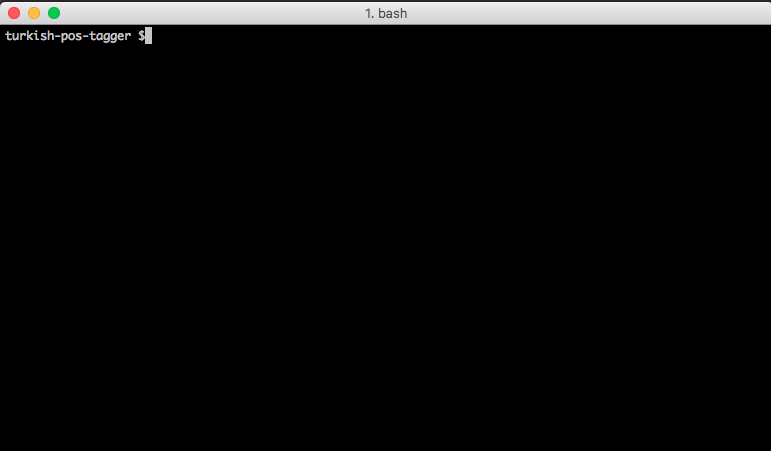
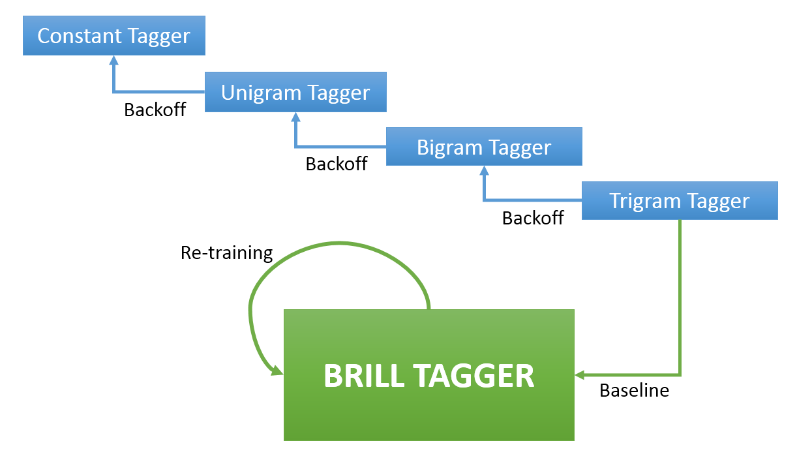
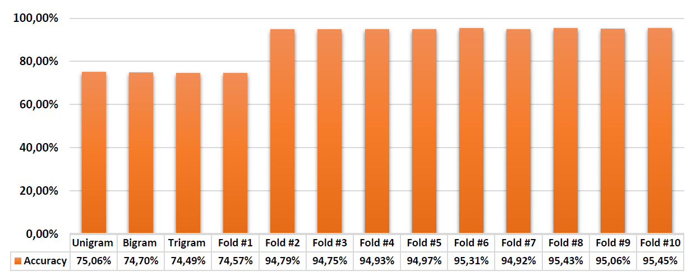

## Part-of-Speech (POS) Tagger for Turkish

### Build and Run
* [Python](https://www.python.org/) and [NLTK](http://www.nltk.org/) is necessary to build and run this project.
 * Python (works with 2.7.11)
 * NLTK (works with 3.2.5)
* The module is named as `pos_tagger` and for the given sentence `tag(sentence)` will return `(word, tag)` pairs.
* The system is trained with the development file provided in [CENG463 course](https://cow.ceng.metu.edu.tr/Courses/index.php?course=ceng463&semester=20121) it includes 5110 sentences. For training:
```
python training_tagger.py
```
* Example:

```
>>> from pos_tagger import tag
>>> tag('Bunu başından beri biliyordum zaten .')
[('Bunu', 'Pron'), ('başından', 'Noun_Abl'), ('beri', 'Postp'), ('biliyordum', 'Verb'), ('zaten', 'Adv'), ('.', 'Punc')]
```

### Build and Run Using Docker
```
docker build -t tagger .
docker run -it tagger python
```
When the shell is opened:
```
>>> from pos_tagger import tag
>>> tag('Bunu başından beri biliyordum zaten .')
[('Bunu', 'Pron'), ('başından', 'Noun_Abl'), ('beri', 'Postp'), ('biliyordum', 'Verb'), ('zaten', 'Adv'), ('.', 'Punc')]
```


### Implementation Idea

* In this part-of-speech tagger application, a transformation based POS system is implemented. In this approach, transformation-based tagger uses rules to specify which tags are possible for words and supervised learning to examine possible transformations, improvements and re-tagging.
* Using NLTK functions, tagged corpus provided in [development.sdx](development.sdx) is read for training and validation purposes. Then, this set is randomly divided into training and development with 85% and 15%.
* As a transformation-based tagger, Brill tagger of NLTK is implemented with maximum rules of 300 and minimum score of 3. Brill tagger uses a general tagging method at the first stage and a trigram tagger is used for that purpose. Back-off stages of this trigram tagger is provided in the next page. Since sufficient information cannot be found about rule templates of Brill tagger, default templates given in [demo code](http://nltk.googlecode.com/svn/trunk/doc/api/nltk.tag.brill-pysrc.html) is directly used.
* Considering k-fold cross validation, this tagger is trained and its performance is tracked, which will be explained in the next section. Flow of operations is shown as a diagram in the following page.


### Results
* The accuracy of this method is tracked for each folding stage in order to avoid over fitting. Since this tagger will be used for tagging unseen sentences we should avoid generating a model which over fits to our development set.
* For 10-fold validation, accuracy of the model can be plotted as below:

* Considering the plot above, the tagger is evaluated at most 6 times by folding training and evaluation tests. The final tagger provided is expected to have 95% of accuracy on development as can be seen from the figure. This final tagger is saved to [my_tagger.yaml](my_tagger.yaml) file by [training_tagger](training_tagger.py) module and it is exported when [pos_tagger](pos_tagger.py) module is called.

### Future Work
* The main problems related to this model can be listed as following:
 * Considering the relatively small development set, there is a high probability of over fitting. Therefore, accuracy level of this model in unseen data can vary very largely.
 * Although implemented, good source of information about Brill rule templates cannot be found. Therefore, better rule templates can be found or unnecessary ones can be eliminated.
 * Considering Turkish as an agglutinative language, rule based methods can be used as back-off or base stage of Brill tagger. Because adding another affix can mislead the tagger as following:

| Function Call      	| Tags                                                        	|
|--------------------	|-------------------------------------------------------------	|
| tag('Ali koş !')   	| [('Ali', 'Noun_Nom'), ('koş’, 'Verb'), ('!', 'Punc')]       	|
| tag('Ali koştu .') 	| [('Ali', 'Noun_Nom'), ('koştu', 'Noun_Nom'), ('.', 'Punc')] 	|

### Conclusion
* To conclude, when the model is evaluated with random parts from development set, accuracy level is calculated as following:

| # of Trial 	| Minimum 	| Maximum 	| Average 	| Std. Dev. 	|
|:------:	|:-------:	|:-------:	|:-------:	|:---------:	|
|   49   	|   91%   	|   96%   	|   95%   	|     1%    	|

* As it is mentioned in Results part, this level of accuracy was expected on random parts of development set. Considering mentioned possible improvements, this model can be enhanced to result with a higher accuracy, especially on tagging unseen sentences.
